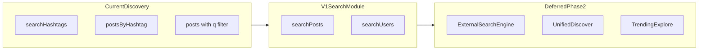

# Real Discovery / Search Beyond Hashtag Prefix (V1 Plan)

Deliverable: implement MySQL-native discovery with dedicated `searchPosts` and `searchUsers` GraphQL operations, keeping existing hashtag prefix search unchanged.

## Problem and Goal

Today discovery is limited to:

- `searchHashtags` in `src/hashtags/hashtags.resolver.ts`: slug prefix autocomplete ordered by `postsCount`
- `postsByHashtag` in `src/hashtags/hashtags.resolver.ts`: chronological hashtag timeline
- `posts(q)` in `src/posts/post-list-read.service.ts`: optional substring `contains` filter on title/content, still a chronological list, not relevance-ranked search

There is no user search. `docs/reviews/backend-maturity-review.md` Phase 2 explicitly calls for discovery beyond hashtag prefix search; Phase 3 covers external search infrastructure.

V1 goal: MySQL-native post and user search.

Out of scope for V1: unified mixed-type search, trending/explore surfaces, external engines (Meilisearch, OpenSearch, etc.), relevance-based cursor pagination, formal `SearchPostsProvider` / `SearchUsersProvider` interfaces, custom GraphQL field complexity extensions, email-based search, raw-SQL over-fetch to backfill short pages, changes to `searchHashtags`, `postsByHashtag`, or `posts(q)`.



## Locked Implementation Decisions (V1)

All items below are final for V1. Implementation must not re-open these without an explicit plan revision.

1. **Module placement** — Dedicated `src/search/` module wired through `AppModule`. Do not add search to `PostsModule` / `UsersModule` list services only.
2. **Normalization** — Shared Zod in `schemas/search-query.schema.ts` with separate post and user command schemas. No `SearchQueryService` in V1.
3. **Phase 2 provider swap** — Informal raw-query + hydrate path inside read services. Formal provider interfaces deferred to Phase 2.
4. **GraphQL pagination shape** — Flat bounded array (`[Post!]!` / `[SafeUser!]!`), same as `searchHashtags`. No connection/cursor/offset in V1.
5. **Default `first`** — `PAGINATION.DEFAULT_TAKE` (20) when omitted; clamp to `PAGINATION.MAX_TAKE` (50).
6. **Throttle** — New `THROTTLE_LIMITS.SEARCH`: `{ limit: 30, ttl: 60 }`. Do not reuse `LIST` for search operations.
7. **FULLTEXT execution** — `$queryRaw` only for `MATCH ... AGAINST` and relevance ordering. Do not enable Prisma `fullTextSearch` preview in V1.
8. **Post FULLTEXT mode** — `IN BOOLEAN MODE` for post `AGAINST` clauses.
9. **Indexed post fields** — `title` and `content` only (no hashtag join table, no author name in post index).
10. **Post social and visibility filters** — Apply viewer visibility, list-surface source availability, blocks, and POSTS mutes on Prisma hydrate via existing `PostReadService` / `MutesService` helpers. Do not reimplement those rules in raw SQL in V1.
11. **User block filter** — Exclude blocks after raw ID fetch using `PostReadService.getBlockedAuthorIds` (mutual block semantics).
12. **User discoverability** — `accountState = ACTIVE` only; include `PUBLIC` and `PRIVATE` privacy; exclude `SUSPENDED` and `DEACTIVATED`.
13. **Email** — Never index or search `email`.
14. **Invalid queries** — `parseWithBadRequest` / `BadRequestException`. Never return `[]` for validation failures.
15. **Abuse guards** — Reject ASCII control chars, queries with no alphanumeric characters after normalization, and runs of 20+ repeated characters. Hashtag reserved-slug rules stay in the hashtag parser only.
16. **Post BOOLEAN sanitization** — Strip or neutralize FULLTEXT boolean operators (`+`, `-`, `*`, `"`, `()`, etc.) in post query normalization, or build a safe quoted phrase for `AGAINST`. Add unit tests for operator-heavy input.
17. **Validation boundary** — GraphQL args use `class-validator` (`@Trim`, `@MaxLength`, `@Min`, `@Max` on `first`) like `SearchHashtagsArgs`; services parse normalized commands with Zod via `parseWithBadRequest`.
18. **Post query max length** — 100 characters on `searchPosts` DTO and Zod (legacy `posts(q)` stays at 50).
19. **User query max length** — 50 characters on `searchUsers` DTO and Zod.
20. **User query whitespace** — Do not collapse whitespace on user queries (single-token usernames).
21. **Raw SQL row cap** — Post and user raw relevance queries use `LIMIT` equal to the requested `first` (after clamp). No over-fetch multiplier in V1.
22. **Short result pages** — After hydrate/social filters, return up to `first` rows; fewer rows is valid in V1. Document in `src/search/README.md` that clients may see sparse pages. Over-fetch backfill deferred to V1.1.
23. **Caching** — Versioned read-through cache via `CacheHelperService.getOrSet`.
24. **Cache TTL and keys** — Posts: TTL `30_000` ms, version key `v:search:posts`, key pattern `search:posts:v${version}:q=${normalizedQ}:viewer=${id|anon}:first=${n}`. Users: TTL `60_000` ms, version key `v:search:users`, key pattern `search:users:v${version}:q=${normalizedQ}:viewer=${id|anon}:first=${n}`.
25. **Cache invalidation** — Bump `v:search:posts` from `PostCacheService` on post create, update, delete, and moderation removal. Bump `v:search:users` from `UserWriteService` and `UserAccountStateService` (best-effort via `runBestEffort`). No wildcard deletes.
26. **Query complexity** — Default estimator only; no per-field complexity extensions on search fields in V1.
27. **Legacy `posts(q)`** — Unchanged behavior and schema in V1. Document-only distinction from `searchPosts`. Deprecation in schema descriptions is V1.1.
28. **Relevance cursors** — Deferred to V1.1.
29. **MySQL token size** — Document and validate `ft_min_word_len` and `innodb_ft_min_token_size` = 2 in local/dev before rollout.
30. **Authenticated viewer guard** — For both `searchPosts` and `searchUsers`, when `viewer.id` is present, assert active current user with the same pattern as `PostListReadService.findPosts` before viewer-aware logic.
31. **Testing** — Service unit specs with mocked `$queryRaw` and collaborators. No new GraphQL e2e suite in V1. Manual `searchPosts` vs `posts(q)` comparison in rollout checklist.

## Architecture

### Module layout

Introduce `src/search/` with:

- `SearchResolver` — auth (`@Public()`), throttle (`SEARCH`), args, delegation only.
- `SearchPostsReadService` — post FULLTEXT, Prisma hydrate filters, projection.
- `SearchUsersReadService` — user FULLTEXT/prefix, account-state/block filters.
- `schemas/search-query.schema.ts` — `searchPostsCommandSchema`, `searchUsersCommandSchema`, parsed via `parseWithBadRequest`.

`SearchModule` imports `PostsModule`, `UsersModule`, `MutesModule`, `PrismaModule`, and cache infrastructure. Register in `AppModule`.

### Reused collaborators

- `PostReadService.buildViewerVisibilityFilters`
- `PostReadService.buildListSurfaceSourceAvailabilityFilter`
- `PostReadService.projectPostListRows`
- `PostReadService.getBlockedAuthorIds`
- `MutesService.getMutedUserIdsForScope` (`MuteScope.POSTS`)
- `SafePostListSelect`, `SafeUserSelect`

### Phase 2 seam

Read services expose one internal path: parameterized raw relevance query → ordered ID list (limited to `first`) → Prisma hydrate + social/visibility filters → projection. Phase 2 may add over-fetch or replace the raw query; resolvers and GraphQL names stay stable.

## GraphQL Contract

### `searchPosts`

```graphql
searchPosts(q: String!, first: Int): [Post!]!
```

- Args: `SearchPostsArgs` with `class-validator` on the GraphQL boundary (`q` max 100, `first` optional with `@Min(1)` and `@Max(PAGINATION.MAX_TAKE)`).
- Service: parse `searchPostsCommandSchema` after DTO validation.
- Return: `SafePostListSelect` + `PostReadService.projectPostListRows` (existing `Post` list shape). May return fewer than `first` items when hydrate filters remove matches.
- Auth: `@Public()` + optional `@CurrentUser()`.
- Viewer guard: assert active user when `viewer.id` is set.
- Throttle: `THROTTLE_LIMITS.SEARCH`.
- Order: relevance DESC, `createdAt` DESC, `id` DESC.
- Pagination: `first` only; no `after` cursor in V1.

### `searchUsers`

```graphql
searchUsers(q: String!, first: Int): [SafeUser!]!
```

- Args: `SearchUsersArgs` with `class-validator` (`q` max 50, `first` optional with `@Min(1)` and `@Max(PAGINATION.MAX_TAKE)`).
- Service: parse `searchUsersCommandSchema` after DTO validation.
- Return: `SafeUser` via `SafeUserSelect`. May return fewer than `first` items when block filters remove matches.
- Auth: `@Public()` + optional `@CurrentUser()` for block filtering.
- Viewer guard: assert active user when `viewer.id` is set (same as `searchPosts`).
- Throttle: `THROTTLE_LIMITS.SEARCH`.
- Order: username-prefix boost, FULLTEXT on `username`/`name`, then `username ASC`.
- Pagination: `first` only.

### Query normalization

| Layer | Post `q` | User `q` |
| --- | --- | --- |
| DTO (`class-validator`) | `@Trim`, `@MaxLength(100)` | `@Trim`, `@MaxLength(50)` |
| Zod (service) | trim; collapse whitespace; lowercase; strip/neutralize boolean operators; min 2 / max 100 | trim; strip `@`; lowercase; min 2 / max 50 |
| Both (Zod) | reject empty after normalize; control chars; no alphanumeric; 20+ repeated chars; `BadRequest` on failure | same |

Hashtag slug validation remains in `hashtag-parser` only.

## MySQL Indexing

Update `prisma/schema.prisma` only (agents must not touch `prisma/migrations/`):

```prisma
model Post {
  // ...
  @@fulltext([title, content])
}

model User {
  // ...
  @@fulltext([username, name])
}
```

### Post search pipeline

1. **Raw SQL (`$queryRaw`)** — relevance only, capped at `LIMIT first`:
   - `MATCH(title, content) AGAINST (? IN BOOLEAN MODE)` using the sanitized post query string
   - `removedAt IS NULL`
   - author `accountState != DEACTIVATED`
   - for anonymous viewers only: author `privacySetting = PUBLIC` (coarse public-only gate)
   - order by relevance, `createdAt`, `id`; return ordered post IDs
2. **Prisma hydrate** — `findMany` where `id IN (...)` with `SafePostListSelect`, preserving raw order, then apply:
   - `buildViewerVisibilityFilters(viewerId)` (authenticated; anon already gated in SQL)
   - `buildListSurfaceSourceAvailabilityFilter(viewerId)`
   - `authorId NOT IN` for blocks (`getBlockedAuthorIds`) and POSTS mutes (`getMutedUserIdsForScope`)
3. **Projection** — `projectPostListRows`; return up to `first` rows (may be fewer).

Do not duplicate `buildListSurfaceSourceAvailabilityFilter` or follower/private visibility logic in raw SQL in V1.

### User search pipeline

1. **Raw SQL** — relevance only, `LIMIT first`:
   - boolean mode with `username*` prefix; natural match on `name`
   - `accountState = ACTIVE`
   - ordered user IDs
2. **Service filter** — for authenticated viewers, drop IDs in `getBlockedAuthorIds(viewerId)`; hydrate with `SafeUserSelect`; return up to `first` rows (may be fewer).

### Operations

Document and validate `ft_min_word_len` / `innodb_ft_min_token_size` = 2 in `src/search/README.md` and local/dev before production rollout. Document sparse pages (fewer than `first` results) for client implementers.

## Visibility and Safety

Authenticated `searchPosts` must match `PostListReadService.findPosts` for:

- viewer visibility (public, following, own)
- blocks and POSTS mutes
- list-surface source availability

All of the above run on Prisma hydrate in V1, not in the raw SQL layer.

Never return raw Prisma models, secrets, or internal SQL errors. Public username/name discovery is intentional.

## Caching

Mirror `HashtagsService.searchHashtags` (version key + `getOrSet` + normalized `q` in cache key).

| Collection | Version key | TTL | Invalidated by |
| --- | --- | --- | --- |
| Posts | `v:search:posts` | 30s | `PostCacheService` on post writes |
| Users | `v:search:users` | 60s | `UserWriteService`, `UserAccountStateService` |

## Legacy `posts(q)`

Unchanged in V1:

- Chronological list with optional `contains` on title/content
- Max query length 50
- Not relevance-ranked

`searchPosts` is the ranked discovery API (FULLTEXT, max 100 chars). Client migration and optional `posts(q)` deprecation descriptions are V1.1.

## Deferred Phase 2 / V1.1

Do not implement in V1:

- External engine (Meilisearch likely default)
- Redis/outbox index sync
- Unified `discover(q)` union results
- Trending/explore surfaces
- Typo tolerance, synonyms, search analytics
- Formal provider interfaces and relevance cursors
- Raw-SQL over-fetch (e.g. `LIMIT first * 3`) to backfill pages shortened by hydrate filters

## Files

**New**

- `src/search/search.module.ts`
- `src/search/search.resolver.ts`
- `src/search/search-posts-read.service.ts`
- `src/search/search-users-read.service.ts`
- `src/search/args/search-posts.args.ts`
- `src/search/args/search-users.args.ts`
- `src/search/schemas/search-query.schema.ts`
- `src/search/README.md`
- `src/search/*.spec.ts`

**Modified**

- `src/app.module.ts`
- `prisma/schema.prisma` (FULLTEXT indexes only)
- `src/common/constants/throttle.constants.ts` (`SEARCH`: 30/min)
- `src/posts/post-cache.service.ts` (`v:search:posts` bumps)
- `src/users/user-write.service.ts` (`v:search:users` bumps on create/update/delete)
- `src/users/user-account-state.service.ts` (`v:search:users` bumps on suspend/reactivate and related state changes)
- `docs/reviews/backend-maturity-review.md`
- `docs/reviews/module-review.md`
- `README.md`

Do not manually edit `src/schema.gql`.

## Testing

Service unit tests only in V1:

- DTO validation (`MaxLength`, `Min`/`Max` on `first`) and Zod normalization (length, trim, `@`, whitespace collapse for posts, charset, repeats)
- post BOOLEAN operator sanitization before raw query binding
- post relevance mock, Prisma hydrate visibility/list-surface filters, blocks, mutes
- post search may return fewer than `first` when filters remove hydrated rows
- anonymous vs authenticated post visibility
- user ordering, ACTIVE-only, no email, blocks, suspended/deactivated excluded
- user search may return fewer than `first` when blocks remove rows
- cache keys, TTLs, version bumps on `PostCacheService`, `UserWriteService`, `UserAccountStateService`
- raw/Prisma errors → sanitized `InternalServerErrorException`

Mock `$queryRaw` like `hashtags.service.spec.ts` and `posts.service.spec.ts`.

## Rollout

1. Add FULLTEXT indexes to `prisma/schema.prisma`.
2. Human: generate and review Prisma migration (agents do not edit `prisma/migrations/`).
3. Apply migration (index backfill automatic).
4. Validate MySQL FT min token = 2 in local/dev.
5. Deploy with `SearchModule`.
6. Manually compare `searchPosts` vs `posts(q)` on sample dev queries before client cutover.

No new env vars for MySQL-native V1.

## Success Criteria

- `searchPosts` and `searchUsers` return relevance-ranked, bounded, safe results (up to `first`, possibly fewer).
- Hashtag discovery and `posts(q)` behavior unchanged.
- AGENTS.md rules satisfied: auth, throttle, DTO + Zod validation, cache, tests, safe DTOs.
- Phase 2 can swap search backend without GraphQL contract changes.
