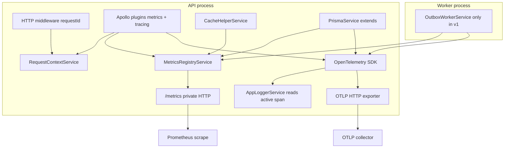

# Broaden Metrics and Add Tracing

**Status:** Plan — implementation decisions locked (not yet implemented)  
**Priority:** Phase 1 roadmap ([backend-maturity-review.md](../reviews/backend-maturity-review.md))  
**Tracing export:** OTLP over HTTP (collector-agnostic: Tempo, Jaeger, Honeycomb, etc.)

## Overview

Extend the existing Prometheus metrics surface beyond outbox/feed projection, add OpenTelemetry tracing with OTLP export, and wire both into request correlation, GraphQL plugins, cache/Prisma instrumentation, and ops docs.

**Client-facing contract:** No GraphQL schema, auth, or response-shape changes. Do not return `traceId` in HTTP headers or GraphQL extensions. Optional `traceparent` on inbound HTTP is accepted for propagation only.

---

## Context (repo + AGENTS.md)

| Layer | Today | Gap |
|-------|--------|-----|
| Correlation | `RequestContextMiddleware` + `RequestContextService` (`requestId`, `operationName`, `userId`) | No `traceId` / `spanId` in logs |
| Logging | `AppLoggerService` structured JSON/pretty | No distributed trace fields |
| Metrics | `MetricsModule` + `MetricsRegistryService` via `prom-client`; dedicated `MetricsServerService` | v1 scoped to outbox/feed/notification suppression |
| Tracing | None (only transitive `@opentelemetry/api` in lockfile) | OTLP export + Nest/GraphQL/Prisma/Redis spans |
| Ops assets | `monitoring/prometheus/outbox-feed-projection-alerts.yml`, Grafana dashboard | No request/cache/DB SLO alerts |

**AGENTS.md constraints:**

- New env vars in `src/config/env/env.schema.ts` and `.env` in the same change
- Code-first GraphQL only; metrics via plugins/services, not `src/schema.gql`
- Low-cardinality Prometheus labels (`operation_name`, `outcome`, `process` — never `user_id` / entity ids)
- Instrumentation must not fail user requests (best-effort recording where needed)
- Service/resolver rules unchanged: no business logic in plugins/interceptors
- Update tests, feature/ops docs, and review docs when implementing

**Backward compatibility:** Do not rename or change labels on existing v1 metric series. New metrics are new series only (no `_v2` suffix rename of v1 names).

**Registry behavior:** When `METRICS_ENABLED=false`, all `MetricsRegistryService` record methods no-op without throwing. Single global flag gates recording in API and worker processes.

**Process label:** Hardcode `process="api"` for the HTTP GraphQL API and `process="worker"` for the outbox worker entrypoint. Do not derive from `OUTBOX_PROCESS_ROLE` for new metrics.

---

## Target architecture

**Correlation model:**

- Preserve `x-request-id` for clients and support workflows
- Honor inbound W3C `traceparent` / `tracestate` when tracing is enabled
- Start a new root trace per HTTP request when no valid parent context is present (do not reuse `requestId` as trace id)
- Structured logs: keep `requestId`, `traceId`, and `spanId` as separate fields when a span exists
- Do not store trace ids in `RequestContextStore`; `AppLoggerService` reads the active OpenTelemetry span at log time

---

## Rollout sequence (locked)

| PR | Scope |
|----|--------|
| **A — Metrics v2** | GraphQL + cache + Prisma metrics, auth/throttle guard counters, new Grafana dashboard JSON, conservative Prometheus alert rules |
| **B — Tracing** | `src/tracing/`, OTLP HTTP bootstrap, auto-instrumentation, log correlation, worker manual spans |
| **C — Docs** | `docs/observability.md`, incident runbook, README links, review doc updates |

Do not split PR A into GraphQL-only vs cache/Prisma follow-ups.

---

## Phase 1 — Prometheus metrics v2 (PR A)

Extend `MetricsRegistryService` with new series. Keep all v1 outbox/feed metrics unchanged.

### 1.1 GraphQL request metrics (API, `process="api"`)

**Plugin:** `src/graphql/plugins/graphql-metrics.plugin.ts`, registered in `createGraphqlConfig`.

| Metric | Labels | Notes |
|--------|--------|-------|
| `graphql_operations_total` | `process`, `operation_name`, `operation_type`, `outcome` | See outcome rules below |
| `graphql_operation_duration_seconds` | `process`, `operation_name`, `operation_type` | Histogram; reuse buckets from `outbox_event_processing_seconds` |
| `graphql_operation_errors_total` | `process`, `operation_name`, `error_code` | Only codes from fixed allowlist |

**Operation naming:**

- Use trusted server-side metadata only (`getOperationName` / subscription metadata). Never parse raw query text for labels.
- Missing operation name → label value `"anonymous"`.
- Skip metrics for introspection (`__schema`, `__type`).
- Include subscriptions with `operation_type=subscription` (duration histogram included).

**Outcome taxonomy (`graphql_operations_total`):**

- `success` — no errors in response
- `graphql_error` — errors present and classified as client-visible per rules below
- `internal_error` — any unsanitized error, non-allowlisted code, or HTTP 500 not forced to 400 by bad-request plugin

**Classification rules (aligned with bad-request plugin + public codes):**

- Treat as `graphql_error` when all errors map to the public contract used by `formatError` / `toPublicGraphqlErrorCode` and the bad-request status plugin would not leave transport as 500 for sanitized-only responses.
- Treat as `internal_error` when any error uses a non-public code, remains `INTERNAL_SERVER_ERROR`, or HTTP status stays 500.
- Do not add `partial_success` as a separate outcome in v1.

**`graphql_operation_errors_total` allowlist:**

- Increment only when `error_code` is in `GRAPHQL_ERROR_CODES` (`src/common/constants/graphql-error-code.constants.ts`).
- Do not record runtime-discovered or unbounded codes.

**Recording:** Duration and counts in `willSendResponse`. Best-effort; never throw from plugin.

**Tests:** Plugin unit tests (mock registry, synthetic contexts) plus thin `metrics-server` integration test asserting new series on `/metrics`.

### 1.2 Cache metrics

Instrument `CacheHelperService` only (not `ping()`).

| Metric | Labels |
|--------|--------|
| `cache_operations_total` | `process`, `operation`, `result` |

**Semantics:**

- `get`: `hit` if value present, `miss` if undefined
- `get_or_set`: `hit` on cache return; `miss` before factory; `write` after successful populate
- `set` / `del`: `result=write` (not hit/miss)
- `error` on caught cache failures
- Wrap increments in try/catch; never throw from cache helper

### 1.3 Prisma metrics

Implement via Prisma Client `$extends` query hook on `PrismaService` calling `MetricsRegistryService` (not a separate metrics-only package; independent of `@prisma/instrumentation` used for traces).

| Metric | Labels |
|--------|--------|
| `prisma_queries_total` | `process`, `model`, `action`, `outcome` |
| `prisma_query_duration_seconds` | `process`, `model`, `action` |

**Outcome values:** `success`, `error`, plus mapped low-cardinality buckets such as `unique_violation`, `not_found`, `foreign_key` (no raw P20xx or SQL in labels).

### 1.4 Guard counters (required in PR A)

| Metric | Labels |
|--------|--------|
| `auth_failures_total` | `process`, `reason` (`unauthorized` / `forbidden`) |
| `throttle_rejections_total` | `process` |

Inject `MetricsRegistryService` into `GqlJwtGuard` and `GqlThrottlerGuard` with best-effort increments only.

### 1.5 Worker

Keep existing v1 outbox/feed metrics. New shared metrics use `process="worker"` where the worker executes code (e.g. Prisma/cache in worker context).

**v1 scope:** Instrument only `outbox-worker.ts` entrypoint — not `hashtag-backfill-reconciliation` or other scripts.

### 1.6 Monitoring (PR A)

**Grafana:** New file `monitoring/grafana/application-observability-dashboard.json` (do not add panels to the outbox/feed dashboard).

**Prometheus:** New file `monitoring/prometheus/application-observability-alerts.yml`.

- Use conservative warning thresholds; expect tuning after ~1 week of baseline traffic
- Mirror outbox alert style where practical (rate-based rules, `for: 10m` style durations)
- **Cache miss alert:** global `miss / (hit + miss)` for `operation="get_or_set"` only (not per-key, not including `set`/`del`)
- Include GraphQL p95 latency and sustained `graphql_operation_errors_total` rules with placeholder thresholds documented as non-final in `docs/observability.md`

**Deployment docs (no K8s manifests in v1):** Document scrape targets and ports in `docs/observability.md` only.

---

## Phase 2 — Distributed tracing (PR B)

**Module layout:** Keep `src/metrics/` for Prometheus; add `src/tracing/` for OpenTelemetry (do not merge into `src/observability/` or bootstrap-only layout).

### 2.1 Dependencies

- `@opentelemetry/sdk-node`
- `@opentelemetry/exporter-trace-otlp-http` (HTTP only in v1; no gRPC dual support)
- `@opentelemetry/instrumentation-http`
- `@opentelemetry/instrumentation-nestjs-core`
- `@opentelemetry/instrumentation-graphql`
- `@opentelemetry/instrumentation-ioredis` (cache Redis and GraphQL pubsub Redis)
- `@prisma/instrumentation` for traces

If `@prisma/instrumentation` conflicts with Prometheus `$extends` on `PrismaService`, keep Prometheus metrics on `$extends` and use manual Prisma trace spans only.

### 2.2 Env contract

| Variable | Default | Purpose |
|----------|---------|---------|
| `TRACING_ENABLED` | `false` | Master switch (with standard `OTEL_*` vars) |
| `OTEL_SERVICE_NAME` | `nestjs-social-graphql-api` | API service name |
| `OTEL_EXPORTER_OTLP_ENDPOINT` | optional | e.g. `http://127.0.0.1:4318/v1/traces` |
| `OTEL_EXPORTER_OTLP_HEADERS` | optional | Collector auth |
| `OTEL_TRACES_SAMPLER` | `parentbased_traceidratio` | Sampler |
| `OTEL_TRACES_SAMPLER_ARG` | `0.1` prod / `1.0` dev | See sampling below |
| `OTEL_RESOURCE_ATTRIBUTES` | optional | e.g. `deployment.environment=development` |

**Worker:** Set `OTEL_SERVICE_NAME=nestjs-social-graphql-api-worker` in `outbox-worker.ts`.

**Sampling:**

- `NODE_ENV=production`: `parentbased_traceidratio` with `OTEL_TRACES_SAMPLER_ARG=0.1` when tracing enabled
- `NODE_ENV=development`: sample ratio `1.0` when tracing enabled

**Missing endpoint:** If `TRACING_ENABLED=true` but `OTEL_EXPORTER_OTLP_ENDPOINT` is unset, log a warning and disable tracing (do not fail startup, do not default localhost silently).

### 2.3 Bootstrap

- `src/tracing/tracing.bootstrap.ts` — idempotent `initTracing()` / `shutdownTracing()`
- Call **before** `NestFactory.create` / `createApplicationContext` in `main.ts` and `outbox-worker.ts`
- `TracingModule` (global) with `TracingService` for manual spans

### 2.4 Auto-instrumentation

- HTTP, NestJS, GraphQL (including subscriptions via `@opentelemetry/instrumentation-graphql` — no manual websocket lifecycle spans in v1)
- ioredis: all clients
- Prisma: `@prisma/instrumentation`

### 2.5 Manual spans

| Area | Span |
|------|------|
| Outbox worker | `outbox.worker.tick` per tick |
| Outbox event | `outbox.event.process` with attr `event_type` |
| Cache `getOrSet` | Child span only when tracing enabled **and** trace is sampled |

Low-cardinality attributes only; never log passwords, tokens, emails, or raw GraphQL variables in spans.

### 2.6 Security

- Default `TRACING_ENABLED=false` locally
- App-side denylist for sensitive headers/attributes: `authorization`, `cookie`, password/token fields
- Do not expose `traceId` to API clients

---

## Phase 3 — Documentation (PR C)

| Deliverable | Purpose |
|-------------|---------|
| `docs/observability.md` | Env tables, metrics catalog, scrape setup, OTLP collector notes, alert tuning guidance |
| `docs/runbooks/observability-trace-log-correlation.md` | Incident steps: `x-request-id` → logs → trace lookup |
| `README.md` | Link to observability doc and this plan; tracing env block |
| `docs/reviews/backend-maturity-review.md` | Update per completed phase |
| `docs/reviews/module-review.md` | Metrics + request context notes |

---

## Testing strategy (locked)

| Area | Approach |
|------|----------|
| GraphQL metrics plugin | Unit tests + thin metrics-server integration test |
| Cache helper | Unit tests for hit/miss/write semantics |
| Prisma extension | Stub/mock extension callbacks |
| Tracing bootstrap | Unit tests with in-memory OTLP exporter when enabled; no-op when disabled; no real collector in CI for v1 |
| Metrics server | Assert new series in registry `/metrics` output |

Run: `npm test`, `npm run lint`.

---

## Non-goals (v1)

- Per-user or per-entity metric labels; wildcard Redis key metrics
- Parsing GraphQL query text for `operation_name`
- `partial_success` outcome; per-operation cache miss alerts
- Guard metrics deferred or skipped
- Separate `METRICS_ENABLED` per process
- `traceId` in client responses
- Instrumenting hashtag reconciliation or other script entrypoints
- K8s `ServiceMonitor` / network policy manifests
- Full SLO/error-budget program; OTel metrics SDK replacing Prometheus
- gRPC OTLP exporter; merged `src/observability/` module
- E2e tests against a real trace collector in CI

---

## Implementation checklist

### PR A — Metrics v2

- [ ] `graphql-metrics.plugin.ts` with outcome rules, allowlist, subscription + anonymous handling
- [ ] `CacheHelperService` metrics (exclude `ping()`)
- [ ] `PrismaService` `$extends` metrics
- [ ] `auth_failures_total` + `throttle_rejections_total` in guards
- [ ] Registry no-op when `METRICS_ENABLED=false`
- [ ] `application-observability-dashboard.json` + `application-observability-alerts.yml`
- [ ] Plugin unit tests + metrics-server integration test

### PR B — Tracing

- [ ] `src/tracing/` bootstrap + module + `TracingService`
- [ ] Env vars in schema + `.env`
- [ ] Auto-instrumentation (HTTP, Nest, GraphQL, ioredis, Prisma)
- [ ] Log `traceId` / `spanId` in `AppLoggerService` from active span
- [ ] Worker spans (tick + event); sampled `getOrSet` child spans
- [ ] OTLP HTTP exporter; warn-and-disable if endpoint missing
- [ ] In-memory OTLP exporter unit tests

### PR C — Docs

- [ ] `docs/observability.md`
- [ ] `docs/runbooks/observability-trace-log-correlation.md`
- [ ] README + review doc updates

---

## Resolved decisions index

All implementation choices for this initiative are locked. Summary by area:

| # | Topic | Decision |
|---|--------|----------|
| 1 | PR A metrics scope | GraphQL + cache + Prisma together |
| 2 | Guard metrics | Included in PR A |
| 3–4 | GraphQL outcomes | `success` / `graphql_error` / `internal_error`; classify via bad-request plugin + public code rules |
| 5 | Error code metric | Allowlist = `GRAPHQL_ERROR_CODES` only |
| 6–8 | GraphQL labels | `"anonymous"` fallback; skip introspection; include subscriptions |
| 9–10 | Histogram / cardinality | Reuse outbox buckets; metadata-only operation names |
| 11–12 | Cache semantics | Full get/getOrSet semantics; exclude `ping()` |
| 13–14 | Prisma Prometheus | `$extends` on `PrismaService`; outcomes include mapped Prisma classes |
| 15–16 | Process / enabled | Hardcode `api`/`worker`; registry no-op when disabled |
| 17–19 | Ops assets | New Grafana file; conservative alerts; global `get_or_set` miss ratio alert |
| 20–34 | Tracing | `src/tracing/`, OTLP HTTP, `TRACING_ENABLED` + `OTEL_*`, sampling by env, full Redis, auto GraphQL subscriptions, root trace per HTTP request, separate log fields, no ALS trace fields, worker spans, sampled cache spans, denylist redaction, worker service name suffix, warn if no endpoint |
| 35 | Client contract | Internal only |
| 36 | Guards | Inject registry, best-effort |
| 37 | Background jobs | Outbox worker only |
| 38 | Deploy docs | `docs/observability.md` only |
| 39 | PR split | Three PRs A / B / C |
| 40 | v1 metrics compat | No breaking changes to existing series |
| 41–42 | Tests | In-memory OTLP; plugin unit + metrics integration |
| 43 | Docs | Observability doc + trace/log runbook |
| 44 | `METRICS_ENABLED` | Single global gate |
| 45 | Trace id exposure | None to clients |

**Alignment:** No conflicts between decisions. **Open tuning only:** numeric alert threshold values after baseline week (decision 18) — documented as placeholders, not blocking implementation start.
