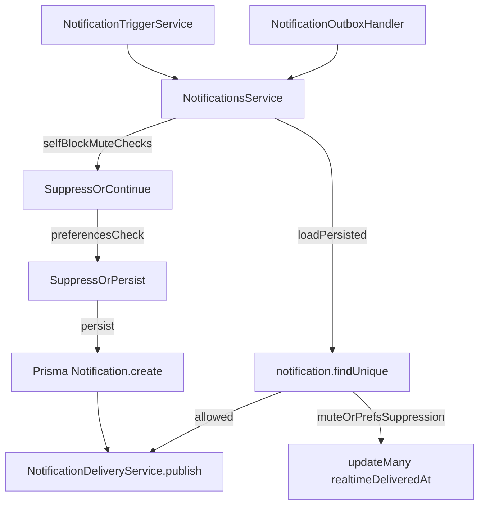

# Notification Preferences

## Overview
Add per-user notification preferences (replies, follow-requests, mentions) with GraphQL read/update operations, and enforce preferences in the notification creation + outbox delivery paths while keeping existing mute/block suppression intact.

## Scope (v1)
- **Toggles**
  - **replyNotificationsEnabled**: controls `NotificationType.COMMENT_REPLIED`
  - **followRequestNotificationsEnabled**: controls `NotificationType.FOLLOW_REQUESTED`
  - **mentionNotificationsEnabled**: controls `NotificationType.POST_MENTIONED` and `NotificationType.COMMENT_MENTIONED`
- **Always enforced regardless of prefs**
  - self-notifications are suppressed (already)
  - block suppression remains enforced (already)
  - muted-user suppression remains enforced (already)
- **Defaults**
  - If no preference row exists, treat all toggles as **ON** (preserve current behavior).

## Data model
- Update `prisma/schema.prisma`
  - Add `NotificationPreference` model:
    - `userId Int @unique`
    - `replyNotificationsEnabled Boolean @default(true)`
    - `followRequestNotificationsEnabled Boolean @default(true)`
    - `mentionNotificationsEnabled Boolean @default(true)`
    - `createdAt`, `updatedAt`
    - Relation: `user User @relation(fields: [userId], references: [id], onDelete: Cascade)`
  - Add optional 1:1 relation field on `User` for ergonomic reads (e.g. `notificationPreference NotificationPreference?`).

## GraphQL API
- Add GraphQL object + input DTOs under `src/notifications/` following existing module conventions:
  - `src/notifications/models/` for `NotificationPreferences` object type
  - `src/notifications/dto/` (or `models/` if the local pattern demands it) for `UpdateNotificationPreferencesInput`
  - Fields:
    - `replyNotificationsEnabled: Boolean!`
    - `followRequestNotificationsEnabled: Boolean!`
    - `mentionNotificationsEnabled: Boolean!`
- Extend `src/notifications/notifications.resolver.ts`
  - `myNotificationPreferences: NotificationPreferences`
    - Protected-by-default (no `@Public()`)
    - `@Throttle({ default: THROTTLE_LIMITS.READ })` (or `LIST` if that’s the repo convention for “my” reads in this module)
    - Resolves by `@CurrentUser() user` and delegates to service
  - `updateNotificationPreferences(input): NotificationPreferences`
    - `@Throttle({ default: THROTTLE_LIMITS.MUTATION })`
    - Accepts `@Args("input") input: UpdateNotificationPreferencesInput`
    - Delegates to service and returns updated preferences

## Services and enforcement
- Add feature-local service: `src/notifications/notification-preferences.service.ts`
  - `getMyPreferences(userId)`
    - Load preferences row
    - If missing, return default-on preferences
  - `updateMyPreferences(userId, input)`
    - Validate via `class-validator` on the GraphQL input DTO
    - Upsert and update only defined fields
    - Return normalized persisted preferences
- Enforce prefs **before** persistence and **before** delivery
  - Update `src/notifications/notifications.service.ts`
    - In `createNotification(...)`:
      - Keep current suppression order (self/block/mute)
      - Add a preferences check keyed by `NotificationType`; if disabled, return `null`
    - In `publishPersistedNotificationIfNeeded(...)`:
      - After loading persisted notification, add a preferences check
      - If disabled:
        - skip publish
        - mark `realtimeDeliveredAt` to stop outbox retries (mirrors muted suppression behavior)
- Wire providers in `src/notifications/notifications.module.ts`

## Caching (only if preferences reads are cached)
- If caching preference reads (recommended since prefs may be checked frequently), use `CacheHelperService.getOrSet` with a per-user **detail key**:
  - Key: `user:notificationPrefs:${userId}`
  - TTL: short (e.g. 5–15 minutes)
- Invalidate on update via `cacheHelper.del(detailKey)` (no wildcard deletion).

## Tests
- Extend `src/notifications/notifications.service.spec.ts`:
  - **Creation suppression**
    - When `replyNotificationsEnabled` is false, `createAndPublishNotification` with `NotificationType.COMMENT_REPLIED` returns `null` and does not call `prisma.notification.create` nor publish
    - When `followRequestNotificationsEnabled` is false, `NotificationType.FOLLOW_REQUESTED` is suppressed
    - When `mentionNotificationsEnabled` is false, both `NotificationType.POST_MENTIONED` and `NotificationType.COMMENT_MENTIONED` are suppressed
  - **Outbox/delivery suppression**
    - When a persisted notification exists but the corresponding preference is disabled, `publishPersistedNotificationIfNeeded` returns `already-delivered`, does not publish, and marks `realtimeDeliveredAt`
- If caching is added, add unit tests for:
  - cache hit/miss behavior on `getMyPreferences`
  - cache invalidation on `updateMyPreferences`

## Schema / migration note
- This plan updates `prisma/schema.prisma`.
- Migration generation/review is still required outside this change set (repo rules: don’t edit files under `prisma/migrations/`).

## Data flow (enforcement points)

